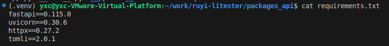
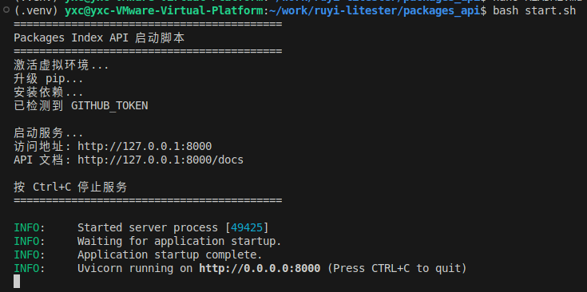
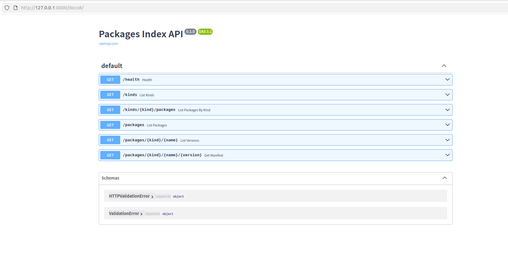

# Packages Index API 项目文档

## 目录

- [项目简介](#项目简介)
- [技术栈](#技术栈)
- [项目结构](#项目结构)
- [快速开始](#快速开始)
- [API 接口文档](#api-接口文档)
- [注意事项](#注意事项)

---

## 项目简介

Packages Index API 是基于 Python 和 FastAPI 的 REST API 服务，用于查询 `ruyisdk/packages-index` 仓库中的软件包信息。

主要功能：
- 分类浏览：按包的类型浏览所有包
- 关键词搜索：在包名和描述中模糊搜索
- 版本查看：查看指定包的所有版本
- 详细信息：获取包的完整 manifest 信息

---

## 技术栈

- FastAPI (0.115.0) - Web 框架，自动生成 API 文档
- Uvicorn (0.30.6) - ASGI 服务器
- httpx (0.27.2) - 异步 HTTP 客户端
- tomli (2.0.1) - TOML 解析库


---

## 项目结构

```
packages_api/
├── app.py              # 核心应用代码
├── requirements.txt    # 依赖包列表
├── start.sh           # 启动脚本
└── DOCUMENTATION.md   # 本文档
```

---

## 快速开始

### 使用启动脚本（Linux/macOS）

```bash
cd packages_api
bash start.sh
```


### 手动启动

Linux/macOS:
```bash
cd packages_api
python3 -m venv .venv
source .venv/bin/activate
pip install -r requirements.txt
cd ..
python -m uvicorn packages_api.app:app --host 0.0.0.0 --port 8000
```

访问地址：
- API 文档：http://127.0.0.1:8000/docs
- 健康检查：http://127.0.0.1:8000/health


---

## API 接口文档

### 1. 健康检查

GET /health

检查服务是否正常运行。

请求示例：
```bash
curl http://127.0.0.1:8000/health
```

响应：
```json
{
  "status": "ok"
}
```

### 2. 列出所有分类

GET /kinds

返回所有包分类列表。

请求示例：
```bash
curl http://127.0.0.1:8000/kinds
```

响应：
```json
["analyzer", "board-image", "emulator", "toolchain"]
```

### 3. 查看分类下的包

GET /kinds/{kind}/packages

返回指定分类下的所有包名。

路径参数：
- kind: 包的分类，如 toolchain、analyzer

请求示例：
```bash
curl http://127.0.0.1:8000/kinds/toolchain/packages
```

响应：
```json
["gnu-milkv-milkv-duo-elf-bin", "gnu-plct-xthead-elf-bin", ...]
```

### 4. 搜索和列出包

GET /packages

列出所有包，支持关键词搜索和分类过滤。

查询参数：
- q: 关键词，在包名或描述中搜索
- kind: 分类过滤

请求示例：
```bash
# 列出所有包
curl http://127.0.0.1:8000/packages

# 关键词搜索
curl "http://127.0.0.1:8000/packages?q=toolchain"

# 分类过滤
curl "http://127.0.0.1:8000/packages?kind=toolchain"

# 组合查询
curl "http://127.0.0.1:8000/packages?q=milkv&kind=toolchain"
```

响应：
```json
[
  {
    "id": "toolchain/gnu-milkv-milkv-duo-elf-bin/0.20240731.0+git.67688c7335e7",
    "kind": "toolchain",
    "name": "gnu-milkv-milkv-duo-elf-bin",
    "version": "0.20240731.0+git.67688c7335e7",
    "desc": "GNU toolchain for Milk-V Duo",
    "vendor": {...},
    "distfiles": [...]
  }
]
```

### 5. 查看包的所有版本

GET /packages/{kind}/{name}

返回指定包的所有版本列表。

路径参数：
- kind: 包的分类
- name: 包的名称

请求示例：
```bash
curl http://127.0.0.1:8000/packages/toolchain/gnu-milkv-milkv-duo-elf-bin
```

响应：
```json
[
  {
    "id": "toolchain/gnu-milkv-milkv-duo-elf-bin/0.20240731.0+git.67688c7335e7",
    "version": "0.20240731.0+git.67688c7335e7",
    "desc": "GNU toolchain for Milk-V Duo",
    "vendor": {...}
  }
]
```

### 6. 获取包的完整信息

GET /packages/{kind}/{name}/{version}

返回指定包的指定版本的完整 manifest 信息。

路径参数：
- kind: 包的分类
- name: 包的名称
- version: 包的版本号

请求示例：
```bash
curl http://127.0.0.1:8000/packages/toolchain/gnu-milkv-milkv-duo-elf-bin/0.20240731.0+git.67688c7335e7
```

响应：
```json
{
  "id": "toolchain/gnu-milkv-milkv-duo-elf-bin/0.20240731.0+git.67688c7335e7",
  "kind": "toolchain",
  "name": "gnu-milkv-milkv-duo-elf-bin",
  "version": "0.20240731.0+git.67688c7335e7",
  "desc": "GNU toolchain for Milk-V Duo",
  "vendor": {...},
  "distfiles": [
    {
      "name": "toolchain.tar.gz",
      "url": "https://...",
      "size": 12345678,
      "checksums": {
        "sha256": "...",
        "sha512": "..."
      }
    }
  ],
  "binary": [...],
  "toolchain": {...},
  "emulator": {...}
}
```
---

## 注意事项

### GitHub API 限流

未设置 GITHUB_TOKEN 时，GitHub 对匿名请求有频率限制。

解决方案：
1. 设置 GITHUB_TOKEN 环境变量
2. 获取 Token：GitHub Settings → Developer settings → Personal access tokens → Generate new token

设置方法：
```bash
# Linux/macOS
export GITHUB_TOKEN=your_token_here
---

