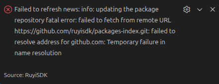
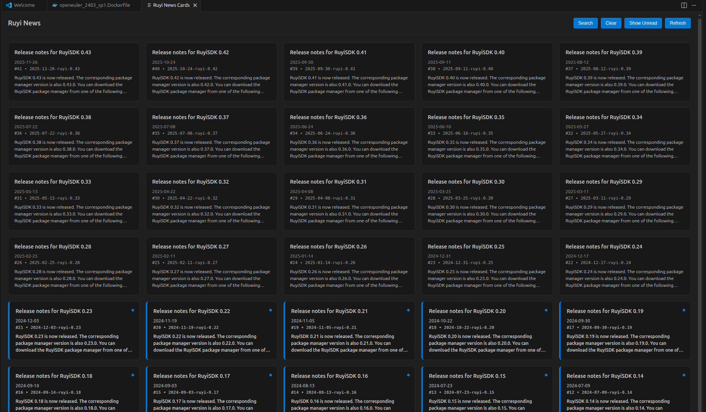
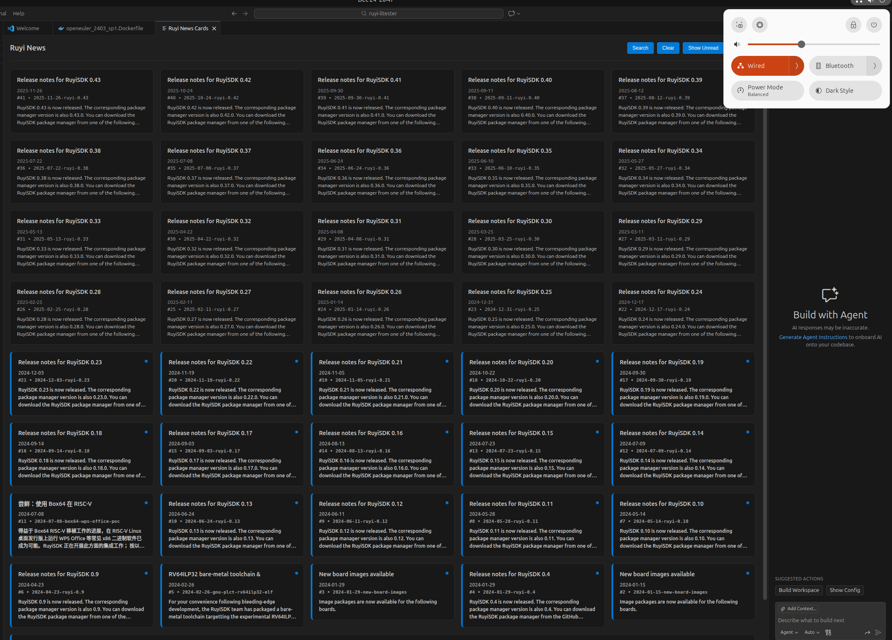

# 新闻缓存和刷新

## 操作步骤

1. 断开网络
2. 打开新闻，获取新闻卡片、读取状态
3. 刷新新闻

## 预期结果

通网状态下能够正常实现新闻缓存和刷新
能够正常实现读取状态跟踪
能够正常进行网络检测，断网状态下不可进行刷新

## 测试结果

能够正常实现新闻缓存和刷新

- 测试读取状态跟踪，断网后将前四排全部阅读完成标记为已阅状态

- 通网后重新打开新闻功能发现状态被成功跟踪，说明测试成功

