# RuyiSDK VSCode 插件功能测试报告

## 1. 基本信息
| 项目       | 详情 |
| ---------- | ---- |
| 测试报告名称 | RuyiSDK VSCode 插件功能测试报告 |
| 测试时间   | 2025-12-04 |
| 测试环境   | 操作系统：VMvare Ubuntu；VS Code 版本：1.106.3 |
| 测试版本   | 插件分支：ff88d84 |
| 测试人员   | 于祥程 |
| 测试类型   | 功能测试 |
| 测试范围   | 安装与准备、Ruyi 包管理器版本管理、新闻功能、包管理、虚拟环境管理、项目模板解压与编译、插件设置 |

## 2. 测试结论概览
- 安装及基础功能均可正常使用，主要功能点通过验证。
- 发现 2 个可优化项（新闻搜索显示/模糊查询），其余均符合预期。

## 3. 详细结果

### 0. 安装与准备
- 下载并解压 `ruyisdk-vscode-extension-<version>.vsix`：通过
- VS Code “Install from VSIX…” 安装并在扩展视图可见：通过
- 期望：安装完成、无报错弹窗：通过

### 1. Ruyi 包管理器版本管理与引导安装
- 启动 VS Code 时未安装包管理器，出现 “Ruyi not found” 提示并可正常安装：-通过  
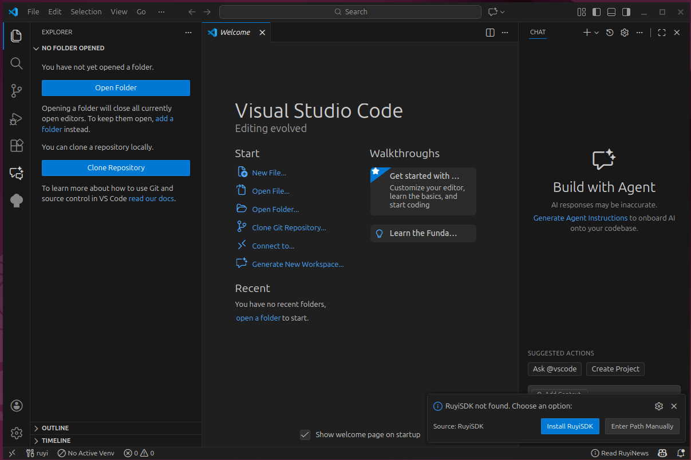
- 补充：未覆盖 pip 缺失场景  
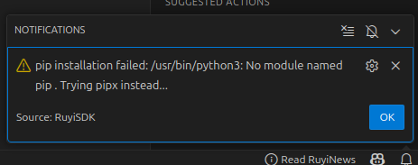
- 支持多版本安装及自由切换：-通过  
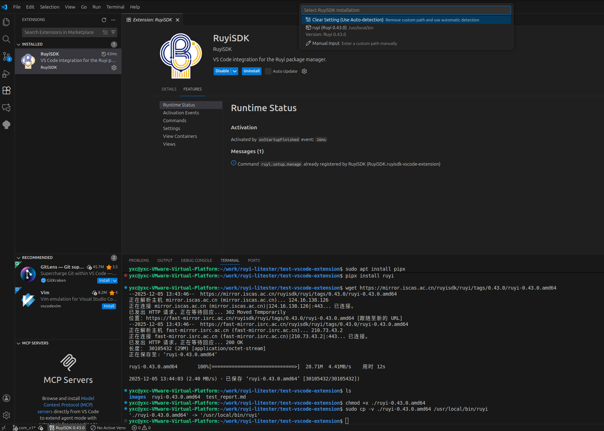

### 2. 新闻（Ruyi News）
- 入口：右下角状态栏
- 覆盖点：打开卡片、搜索关键词、切换“仅未读”、手动刷新
- 期望：加载正常、搜索过滤准确、刷新后数据更新、无空白或卡死
- 结果：
  - 状态栏入口加载正常-通过  
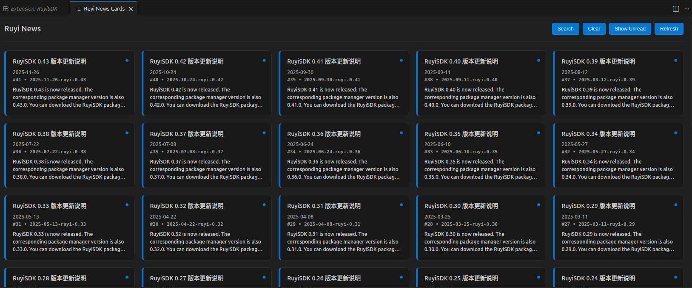
  - 卡片内容加载正常-通过  
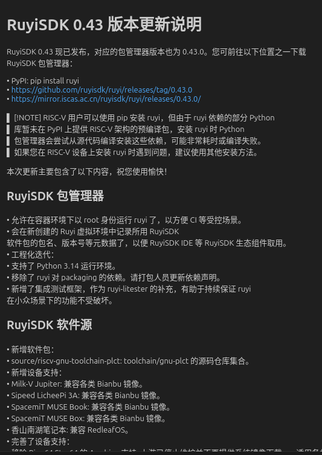
  - 搜索过滤准确-通过  
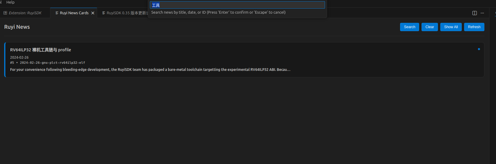
  - 手动刷新后数据更新并有提示-通过  
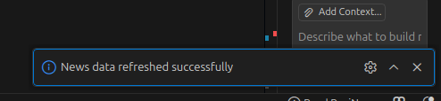
  - 切换“仅未读”正常-通过  
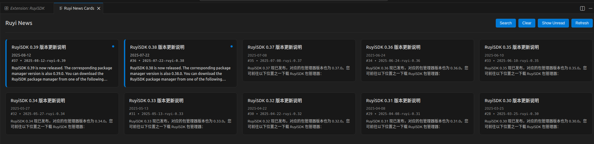
- 优化建议：
  - 搜索后页面左上角显示当前搜索条件，便于确认筛选。
  - 支持模糊查询，比如输入 0.47 时虽然没有0.47但匹配到全部 0.4x 版本。

### 3. 包管理
- 入口：侧栏 “Ruyi” 选项卡
- 覆盖点：搜索并一键安装、查看进度与结果、失败提示与重试
- 期望：安装流程可视化，已安装包状态正确展示，有友好提示
- 结果：
  - 安装流程正常且有提示-通过  
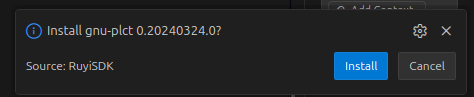  
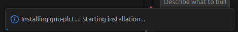  
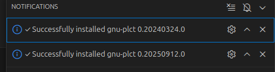  
  - 已安装包状态展示正确-通过  
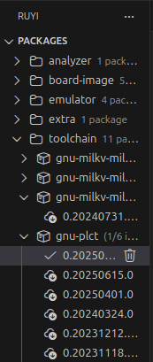

### 4. 虚拟环境管理
- 入口：侧栏 “Ruyi” 选项卡
- 覆盖点：自动检测现有环境、图形化创建（toolchain 选择/自动安装提示、多 toolchain 可选、模拟器/名称/路径/sysroot 等参数）、创建后管理与激活
- 限制说明：当前不支持复杂 profile
- 期望：创建流畅、参数校验清晰、环境可正常激活与切换
- 结果：
  - 自动检测现有环境正常-通过  

  - 图形化创建功能正常，可进行toolchain选择、参数填写-通过  
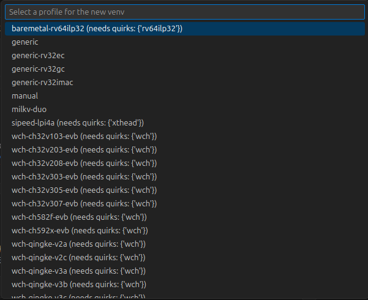
- 创建完成后可在侧栏通过点击操作进行激活和切换-通过  
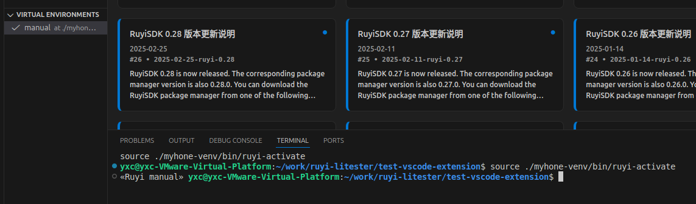
### 5. 解压项目模板与编译
- 入口：Explorer 文件树右键
- 覆盖点：通过包管理器解压模板；结合虚拟环境与 toolchain 进行编译
- 期望：模板解压成功且结构正确；选择虚拟环境后可完成编译并生成产物
- 结果：
  - 通过 Ruyi 包管理器解压已有项目模板(这里初步尝试下载了coremark用于测试解压)-通过
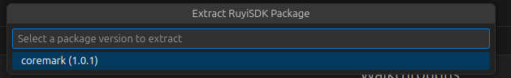
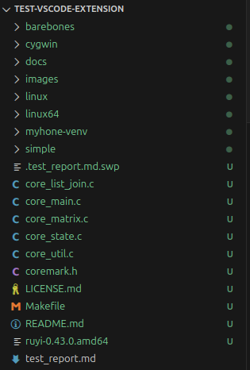
  - 结合已创建的虚拟环境与所选 toolchain 进行编译(这里采用了官方文档中的“Milkv Duo ：使用 riscv64-unknown-linux-musl-bin 工具链编译、运行、调试”进行测试)-通过
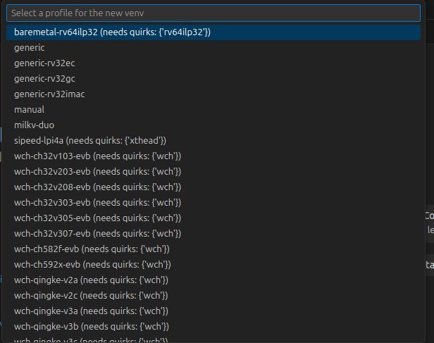
  - 这里环境选择milkv duo
  - 解压后目录如下
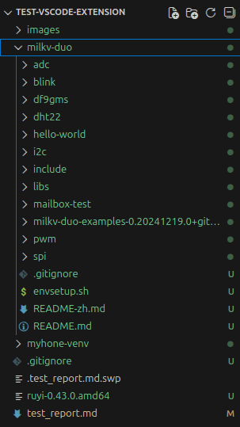
### 6. 插件设置
- 入口：Extensions 页面选择 RuyiSDK 后进入 settings
- 期望：每个项目可用并如期运行
