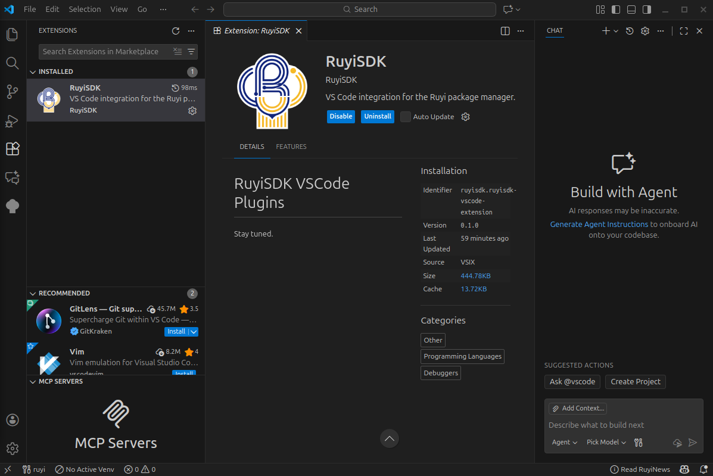

一、测试基本信息
项目          	详情
测试报告名称	RuyiSDK VSCode 插件功能测试报告
测试时间	2025-12-04
测试环境	操作系统：VMvare Ubuntu、VS Code 版本：1.106.3
测试版本	插件分支：ff88d84
测试人员	于祥程
测试类型	功能测试
测试范围	安装与准备、Ruyi 包管理器版本管理、新闻功能、包管理、虚拟环境管理、项目模板解压与编译、插件设置
二、测试结果
0. 安装与准备
- 从仓库页面下载最新构建的压缩包，解压获得 `ruyisdk-vscode-extension-<version>.vsix`          通过
- 在 VS Code 中执行 “Install from VSIX…”，确认安装成功                                        通过
- 期望结果：扩展安装完成且在扩展视图可见；无报错弹窗                                          通过

 
