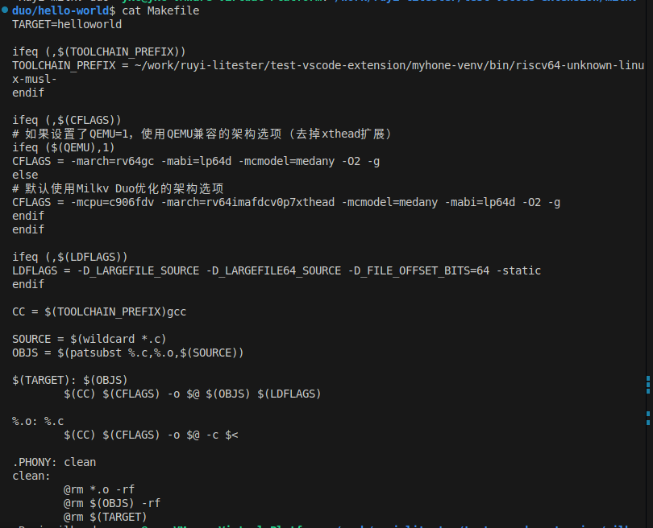
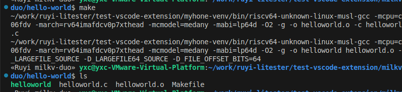
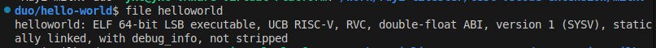
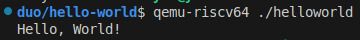
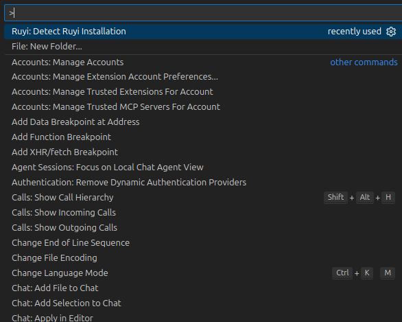
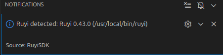
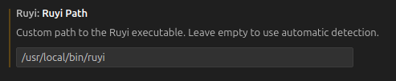
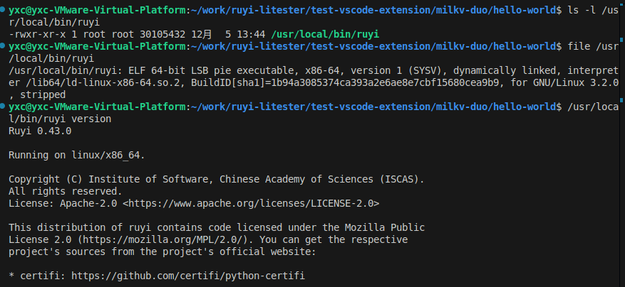
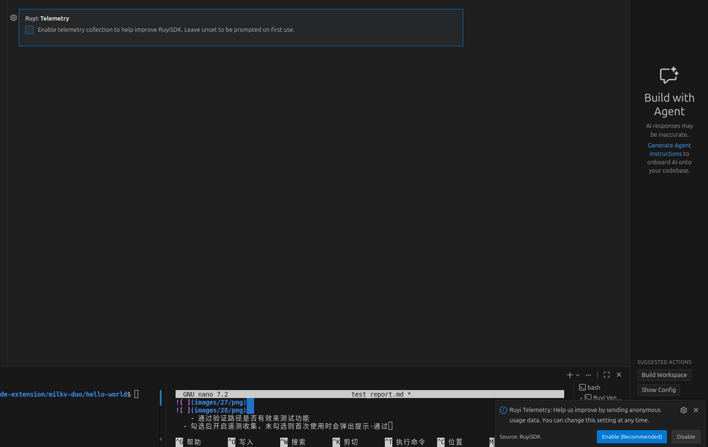

# RuyiSDK VSCode 插件功能测试报告

测试报告 | 功能测试 | 2025-12-04

---

## 目录

- [基本信息](#基本信息)
- [测试结果](#测试结果)
  - [安装与准备](#0-安装与准备)
  - [Ruyi 包管理器版本管理与引导安装](#1-ruyi-包管理器版本管理与引导安装)
  - [新闻（Ruyi News）](#2-新闻ruyi-news)
  - [包管理](#3-包管理)
  - [虚拟环境管理](#4-虚拟环境管理)
  - [项目模板解压与编译](#5-解压项目模板与编译)
  - [插件设置](#6-插件设置)

---

## 基本信息

| 项目 | 详情 |
|:----:|:----:|
| **测试报告名称** | RuyiSDK VSCode 插件功能测试报告 |
| **测试时间** | 2025-12-04 |
| **测试环境** | 操作系统：VMware Ubuntu VS Code 版本：1.106.3 |
| **测试版本** | 插件分支：`ff88d84` |
| **测试人员** | 于祥程 |
| **测试类型** | 功能测试 |
| **测试范围** | 安装与准备、Ruyi 包管理器版本管理、新闻功能、包管理、虚拟环境管理、项目模板解压与编译、插件设置 |

---

## 测试结果

### 0. 安装与准备

#### 测试步骤

1. 下载并解压 `ruyisdk-vscode-extension-<version>.vsix`
2. VS Code "Install from VSIX…" 安装并在扩展视图可见、无报错弹窗

#### 测试结果

**状态：** 通过

### 1. Ruyi 包管理器版本管理与引导安装

#### 测试覆盖点

- 启动 VS Code 时未安装包管理器的引导安装
- 多版本安装及自由切换

#### 测试结果

- 启动 VS Code 时未安装包管理器，出现 "Ruyi not found" 提示并可正常安装-通过

  

- 支持多版本安装及自由切换-通过

  

### 2. 新闻（Ruyi News）

#### 测试覆盖点
- 打开新闻卡片
- 搜索关键词
- 切换"仅未读"
- 手动刷新

#### 测试结果

- 状态栏入口加载正常-通过

  

- 卡片内容加载正常-通过

  

- 搜索过滤准确-通过

  

- 手动刷新后数据更新并有提示-通过

  

- 切换"仅未读"正常-通过

  

#### 功能缺陷（优化建议）

1. **搜索条件显示**
   - 搜索后页面左上角显示当前搜索条件，便于确认筛选

2. **模糊查询支持**
   - 支持模糊查询，比如输入 `0.47` 时虽然没有 `0.47` 但匹配到全部 `0.4x` 版本

3. **标记已读未读**
   - 仅支持点击后变为已读状态，可以加入将已读信息标记为未读状态的功能
### 3. 包管理

#### 测试覆盖点
- 搜索并一键安装
- 查看进度与结果
- 失败提示与重试

#### 测试结果

- 安装流程正常且有友好提示-通过

  

  

  

- 已安装包状态展示正确-通过

  

### 4. 虚拟环境管理

#### 测试覆盖点
- 自动检测现有环境
- 图形化创建
  - Toolchain 选择
  - 自动安装提示
  - 多 toolchain 可选
  - 模拟器/名称/路径/sysroot 等参数配置
- 创建后管理与激活

#### 测试结果

- 自动检测现有环境正常-通过

  

- 图形化创建功能正常，可进行toolchain选择、参数填写-通过

  

- 创建完成后可在侧栏通过点击操作进行激活和切换-通过

  
### 5. 解压项目模板与编译

#### 测试覆盖点
- 通过包管理器解压模板
- 结合虚拟环境与 toolchain 进行编译

#### 测试期望
- 模板解压成功且结构正确
- 选择虚拟环境后可完成编译并生成产物

#### 测试结果

通过 Ruyi 包管理器解压已有项目模板（测试解压功能随意选了coremark）

解压结果

结合已创建的虚拟环境与所选 toolchain 进行编译

**测试案例：** 官方文档Milkv Duo：使用 riscv64-unknown-linux-musl-bin 工具链编译、运行、调试

**测试步骤：**

1. **环境选择：** milkv duo-通过

   

2. **下载应用示例：** duo-examples，解压后目录结构-通过

   

3. **Makefile 配置：** 设置 toolchain 等参数-通过

   与测试流程中的样例不同，这里需要修改 Makefile，设置 toolchain 等参数

   

4. **编译结果：** 编译后生成产物 `helloworld`-通过

   

5. **运行测试：** 使用 qemu 模拟器运行 RISC-V64 架构产物并运行-通过

   

   

#### 功能缺陷（优化建议）

1. **模板库可视化**
   - 没有查询可下载模板的命令或在插件中内置可视化模块，仅支持按名下载
2. **模板解压自动覆盖**
   - 当在右键解压相同的模板时，若解压地址和上次相同，则会直接默认覆盖原先内容，修改的内容会丢失
### 6. 插件设置

#### 测试期望
- 每个项目可用并如期运行

#### 测试结果

- 运行detect命令时会自动检查 Ruyi 的更新-通过

  

  

- 自定义 Ruyi 可执行文件的路径，留空则会自动检测-通过

  

  

  - 通过验证路径是否有效来测试功能

- 勾选后开启遥测收集，未勾选则首次使用时会弹出提示-通过

  

---
